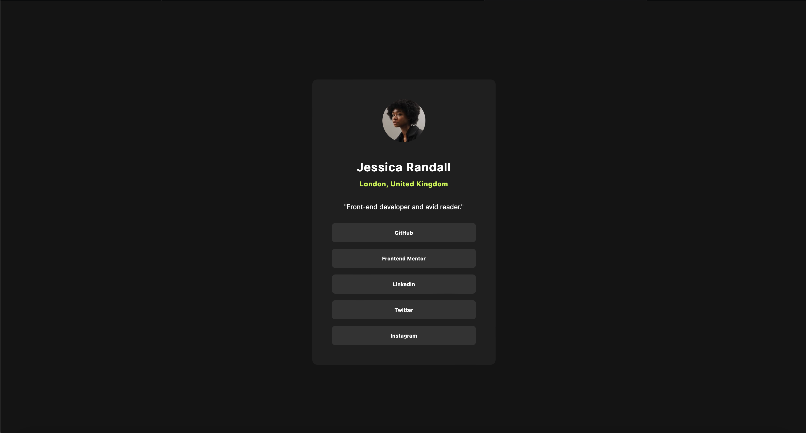

# Frontend Mentor - Social links profile solution

This is a solution to the [Social links profile challenge on Frontend Mentor](https://www.frontendmentor.io/challenges/social-links-profile-UG32l9m6dQ). Frontend Mentor challenges help you improve your coding skills by building realistic projects. 

## Table of contents

- [Overview](#overview)
  - [The challenge](#the-challenge)
  - [Screenshot](#screenshot)
  - [Links](#links)
- [My process](#my-process)
  - [Built with](#built-with)
  - [What I learned](#what-i-learned)
- [Author](#author)

## Overview

### The challenge

Users should be able to:

- See hover and focus states for all interactive elements on the page

### Screenshot



### Links

- Solution URL: [https://github.com/hackz101/social-links-profile-main](https://github.com/hackz101/social-links-profile-main)
- Live Site URL: [https://social-links-profile-main-pi-five.vercel.app/](https://social-links-profile-main-pi-five.vercel.app/)

## My process

### Built with

- Semantic HTML5 markup
- CSS custom properties
- CSS Grid
- Responsive workflow
- [Normalize.css](https://necolas.github.io/normalize.css/) - For CSS resets

### What I learned

While going through this challenge, I learned that you can actually just put buttons directly into an unordered list instead of setting their display to block:

```html
<ul>
  <li><button>GitHub</button></li>
  <li><button>Frontend Mentor</button></li>
  <li><button>LinkedIn</button></li>
  <li><button>Twitter</button></li>
  <li><button>Instagram</button></li>
</ul>
```

## Author

- Frontend Mentor - [@hackz101](https://www.frontendmentor.io/profile/hackz101)
